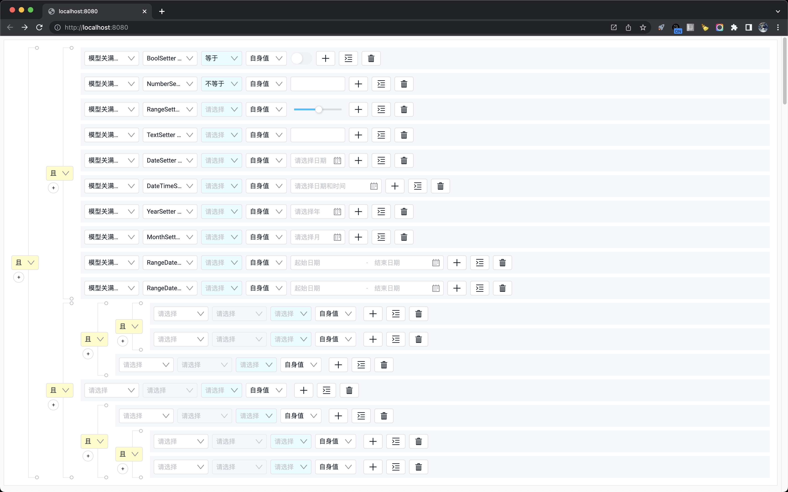

# THX Portal Rule

THX 可视化规则编辑器。



## 安装

```sh
yarn add thx-portal-rule
```

## 使用

```jsx
import { mock } from 'mockjs'
import { RuleEditor, IRuleModel } from 'thx-portal-rule'

const MOCK_MODEL_LIST: IRuleModel[] = mock({
  'list|10': [{
    'id|1000-9999': 1,
    name: '模型@cword(5)',
    code: '@word(5)',
    'fields|10': [
      {
        'id|1000-9999': 1,
        name: '字段@cword(5)',
        code: '@word(5)'
      }
    ]
  }]
}).list

export default function App () {
  const [content, setContent] = useState(MOCK_CONTENT)
  return <>
    <RuleEditor models={MOCK_MODEL_LIST} content={content}
      onChange={(nextContent) => setContent(nextContent)}
    />
    <pre>{JSON.stringify(content, null, 2)}</pre>
  </>
}
```

## 示例

```sh
yarn run examples:start
```
